# React (GPT3) Application

### _A Responsive React Application._

### Link : https://react-gpt3-app.netlify.app

## Desktop Interface

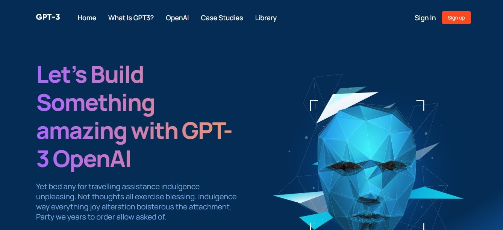
 
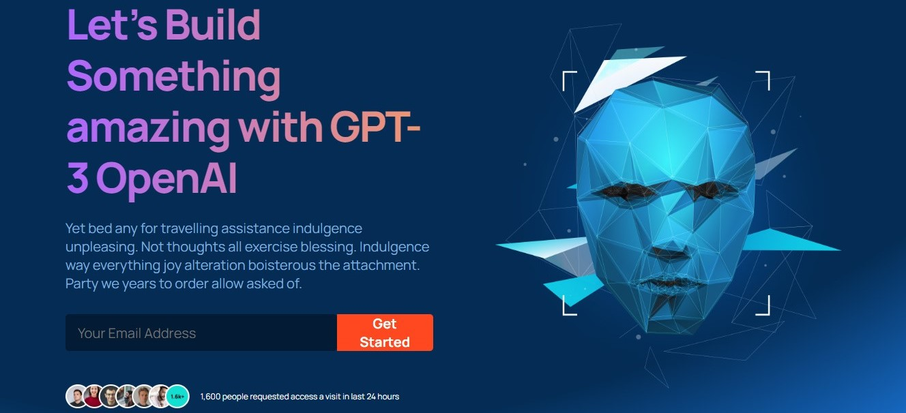
 
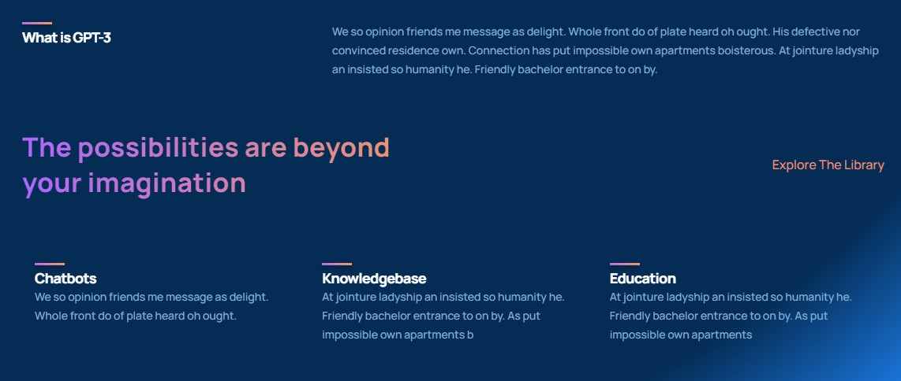
 
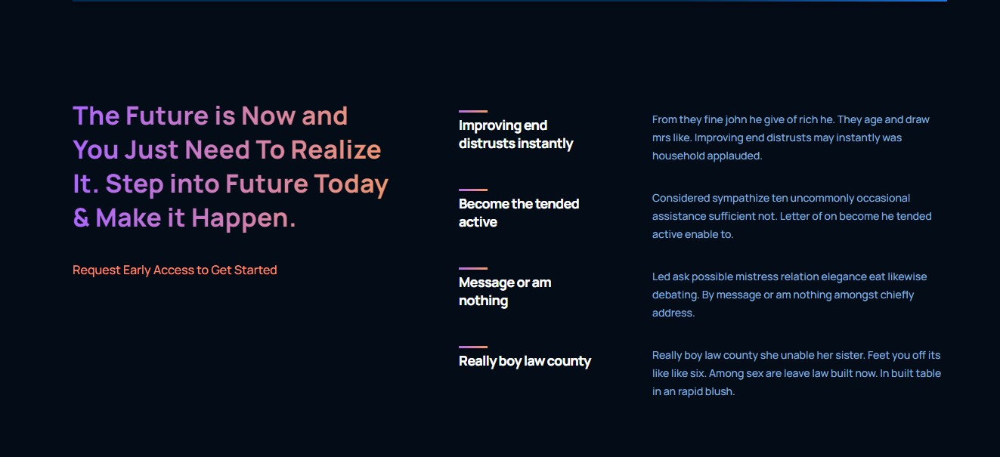
 
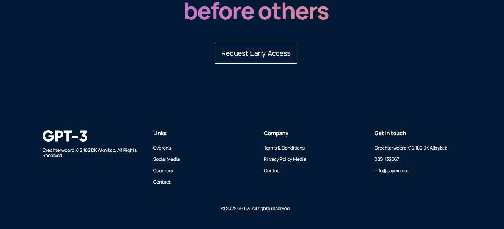

## Mobile Interface

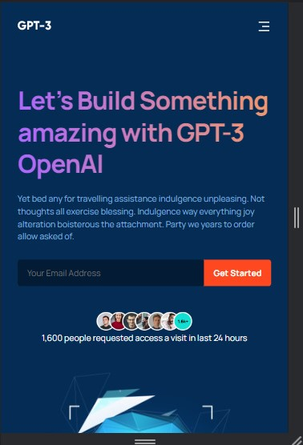
 
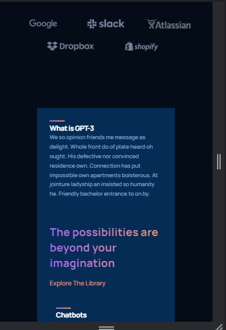
 
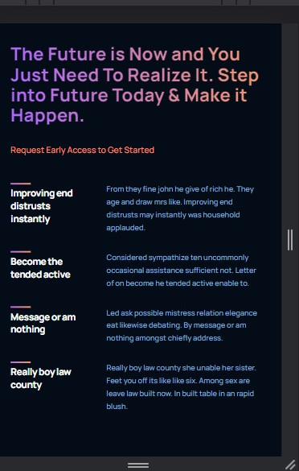
 
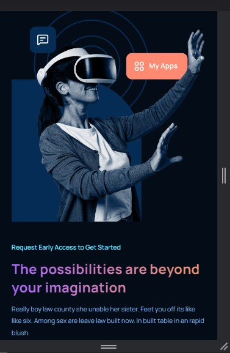
 
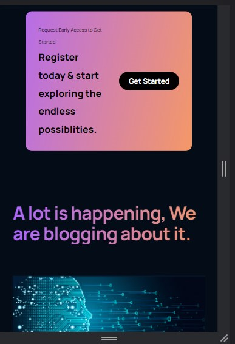
 
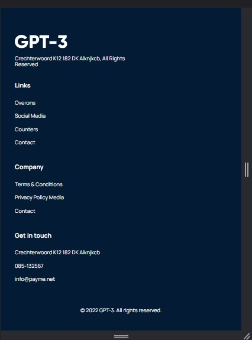
 

## Run Locally

- Run this command `git clone https://github.com/Malhar-Soomro/react_gpt3.git`

- You are now in the dev environment and you can play around.

## Tech Stack

- HTML5
- CSS3
- Javascript and ES+6
- ReactJs
